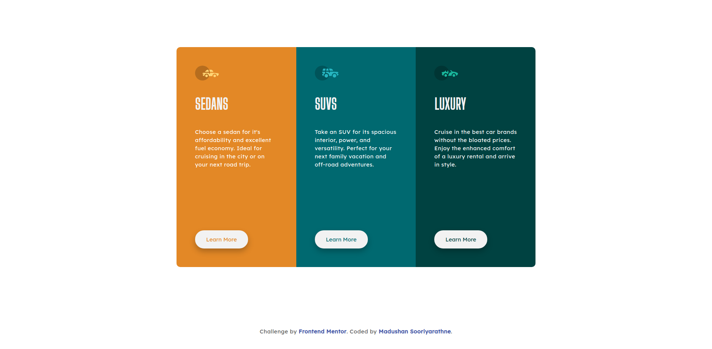

# Frontend Mentor - 3-column preview card component solution

This is a solution to the [3-column preview card component challenge on Frontend Mentor](https://www.frontendmentor.io/challenges/3column-preview-card-component-pH92eAR2-). Frontend Mentor challenges help you improve your coding skills by building realistic projects.

## Table of contents

- [Overview](#overview)
  - [The challenge](#the-challenge)
  - [Screenshot](#screenshot)
  - [Links](#links)
- [My process](#my-process)
  - [Built with](#built-with)
- [Author](#author)

## Overview

### The challenge

Users should be able to:

- View the optimal layout depending on their device's screen size
- See hover states for interactive elements

### Screenshot

#### Desktop View

#### Mobile View

### Links

- Solution URL: [Github](https://github.com/madushan-sooriyarathne/frontend-mentor-3-column-previw-card)
- Live Site URL: [Netlify](https://three-column-preview.netlify.com)

## My process

### Built with

- Semantic HTML5 markup
- Sass

## Author

- Website - [Madushan Sooriyarathne](https://madushan.dev)
- Frontend Mentor - [@madushan-sooriyarathne](https://www.frontendmentor.io/profile/madushan-sooriyarathne)
- Github - [@madushan-sooriyarathne](https://www.github.com/madushan-sooriyarathne)
